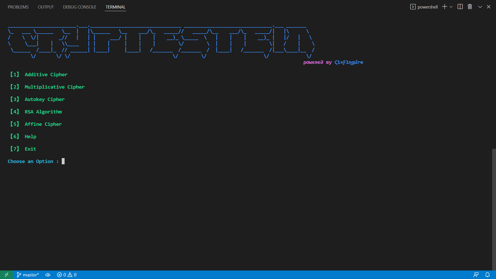

# Cryptestein
Cryptestein is a modern tool written in Python that encrypt and decrypts text.
The tool provides standard encryption and decryption ciphers along with functionality to brute force encrypted text to get the original or plain text.

Cryptestein ships regularly with new features and bug fixes.

