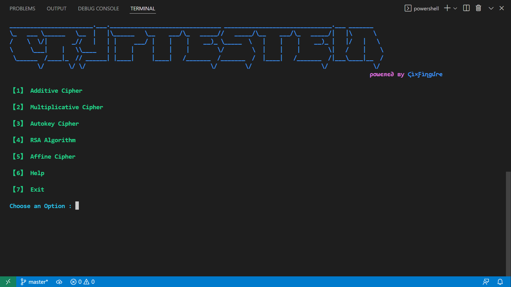
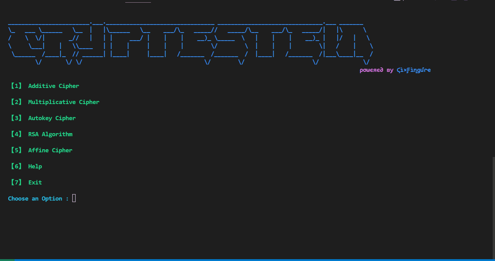

# Cryptestein
Cryptestein is a modern tool written in Python that encrypt and decrypts text.
The tool provides standard encryption and decryption ciphers along with functionality to brute force encrypted text to get the original or plain text.

Cryptestein ships regularly with new features and bug fixes.

## Features
- Choose one out of 5 currently available cipher to encrypt or decrypt your text.
- Help button is provided in case you don't know the methodology behind each cipher.
- Each cipher you choose has a brute force functionality in case the key through which you want to decrypt is missing.
- Back and Exit buttons are implemented, if you have entered wrong input text or a key value.
- Every error is handled smoothly with an illustration which shows what went wrong and how to fix it.

## Getting started
Prerequisites:
- Your computer must be running on Windows 10 or newer or any linux system.
- Install the latest version of [Visual Studio](https://visualstudio.microsoft.com/downloads/) (the free community edition is sufficient) or any other code editor or terminal will work.
  - Install python extension on the system and on visual studio.
  - Run the script by going to the location where you have saved the cryptestein from the terminal.

## Demonstration
Encryption:

